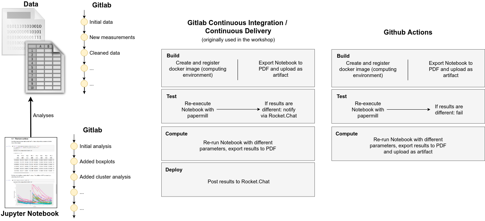

# Workshop Materials: Reproducible Data Science with Jupyter Notebooks

This repository contains the materials used in the workshop **"Reproducible Data Science with Jupyter Notebooks"** that took place as part of the kick-off event of the [ORDS graduate network](https://www.uni-rostock.de/forschung/nachwuchsfoerderung/graduiertenakademie/netzwerke/ords/) at the University of Rostock in December 2020.
It extends the workshop of Anja Eggert that is published at https://github.com/AnjaEggert/ords-kick-off as well as included as a git submodule.

> Publishing not only the results, but also source code and data is central in the discussion about open science and the FAIR principles.
> Literate programming is the concept of interweaving documentation, code, and data and, thus, fosters the publication of a comprehensive document containing not only the results of a research analysis, but the analysis itself.
> Jupyter notebooks are one implementation of this concept.
> This workshop employs Jupyter notebooks examples to illustrate these aspects.

In particular, these materials originally aim at the use in a virtual research environment that provides two services:

1. a [GitLab](https://about.gitlab.com/) instance including the possibility to use Gitlab CI/CD for automated jobs, and
2. a [Rocket.Chat](https://rocket.chat/) instance to push the results of the automated data analysis and validity checks.

In this repository, the code has been partly adapted to the [Github Actions](https://docs.github.com/en/actions) infrastructure so that everything except for the reporting via a chat message runs analogously.
The original Gitlab-CI configuration can, however, be found in the `.gitlab-ci.yml` file.

## License

[](http://creativecommons.org/licenses/by/4.0/)

This work is if not otherwise stated licensed under a [Creative Commons Attribution 4.0 International License](http://creativecommons.org/licenses/by/4.0/).
See the section below for third party contents and the corresponding licenses.

In order to reference the GitHub repository, please attribute this as:

Max Schröder and Frank Krüger. “Workshop Materials: Reproducible Data Science with Jupyter Notebooks,” https://github.com/m6121/Workshop-ORDS-Reproducible-Data-Science

### Third Party Contents

This repository contains parts of other publications of open source software and data listed below:

1. The data that is analysed in the Jupyter notebook `Data-analysis.ipynb` is included via a git submodule in the folder `Rmarkdown-workshop`. It refers to the following original publication (CC-BY 4.0):
   Anja Eggert. "Workshop Materials: Reproducible statistical data analysis with R and RMarkdown," https://github.com/AnjaEggert/ords-kick-off


## Repository Structure

The repository is structured as follows:

1. `Rmarkdown-workshop` is a git submodule that contains the original analysis written in Rmarkdown as well as the data that will be analysed.
2. `Data-analysis.ipynb` is the Jupyter notebook example that will analyse the data. It employs several other software such as [nbdime](https://github.com/jupyter/nbdime), [papermill](https://github.com/nteract/papermill), and the [jupyter-contrib-nbextensions](https://jupyter-contrib-nbextensions.readthedocs.io/).
3. `Dockerfile` as well as the `requirements.txt` specify the computing environment including all necessary software dependencies to run the Jupyter notebook.
4. `.github` contains the Github Actions job specification.
5. `.gitlab-ci.yml` contains the Gitlab-CI configuration as a reference for the original workshop tasks.
6. `push_to_chat.py` is a python script that will push files to a chat server. This file is only included as a reference of the original workshop material.

In addition to this material and as a result of the CI jobs, ready-to-use docker images are created at the following repository in the Docker hub: https://hub.docker.com/r/m6121/ords-reproducible-data-science

## Usage

These materials are intended to demonstrate tools that help making research more reproducible.
Specifically, the following CI procedures are implemented:



During the workflow two results are produced:

1. the artifacts that can be downloaded from the summary page of the jobs, e.g. https://github.com/m6121/Workshop-ORDS-Reproducible-Data-Science/actions/runs/488053999
2. the docker images that are registered in the docker hub: https://hub.docker.com/r/m6121/ords-reproducible-data-science

However, to run the analysis locally, clone the repository and checkout the sub-modules as follows:

```bash
$ git clone https://github.com/m6121/Workshop-ORDS-Reproducible-Data-Science.git
$ git submodule update --init
```
Afterwards, you can either build the docker environment by yourself or use the following ready-to-use images.

### Ready-to-use Docker Images

[](https://hub.docker.com/r/m6121/ords-reproducible-data-science/) [](https://hub.docker.com/r/m6121/ords-reproducible-data-science/)

The probably easiest way is to use the corresponding docker image: `m6121/ords-reproducible-data-science:latest`:

```bash
$ docker run --rm \
    --name=ords-workshop \
    -p 127.0.0.1:8888:8888 \
    -v "$PWD":/home/jovyan/work \
    --user root \
    -e NB_UID=$(id -u) \
    -e NB_GID=$(id -g) \
    m6121/ords-reproducible-data-science:latest
```
The parameters configure the following:

1. `--rm` removes the container automatically after stopping,
2. `--name=ords-workshop` gives the container the name `ords-workshop` instead of a random one,
3. `-p 127.0.0.1:8888:8888` binds the container port `8888` (3. part) to the host ip address `127.0.0.1` and port `8888` (2. part),
4. `-v "$PWD":/home/jovyan/work` binds the current directory `$PWD` to the container directory `/home/jovyan/work`,
5. `--user root` is needed in order to set the UID and GID of the user running the Jupyter service inside the container,
6. `-e NB_UID=$(id -u)` and `-e NB_GID=$(id -g)` are used to set the user and group ID to the same as the user on the host in order to enable write access to the volume mounted by `-v`.

To search available docker images, use the corresponding Docker Hub repository: https://hub.docker.com/r/m6121/ords-reproducible-data-science
